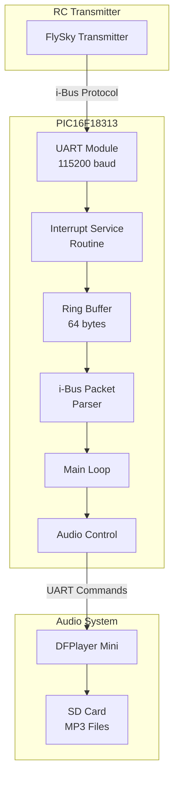
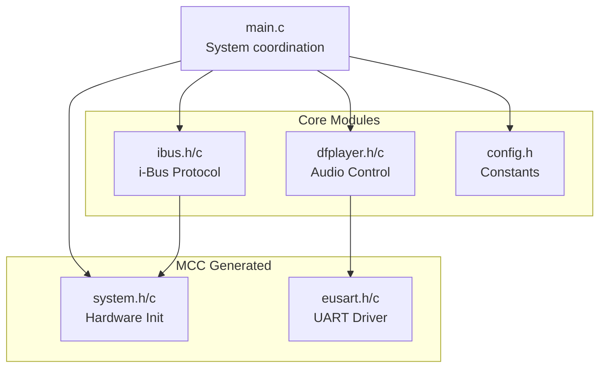
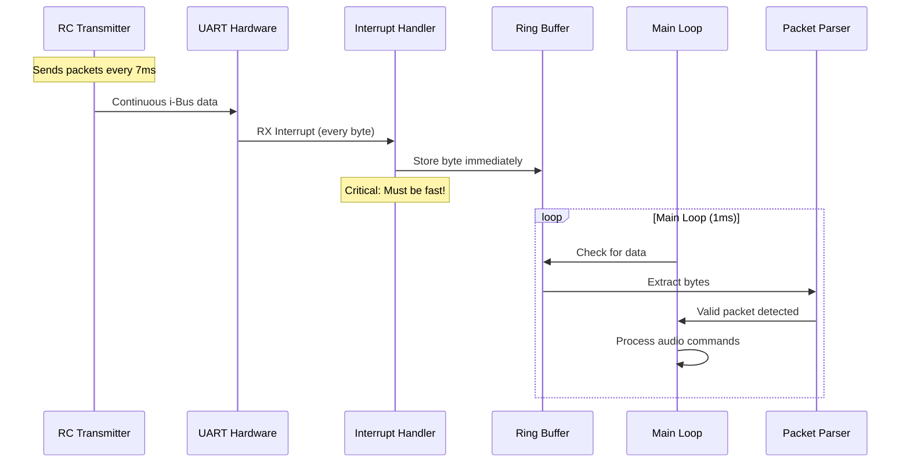
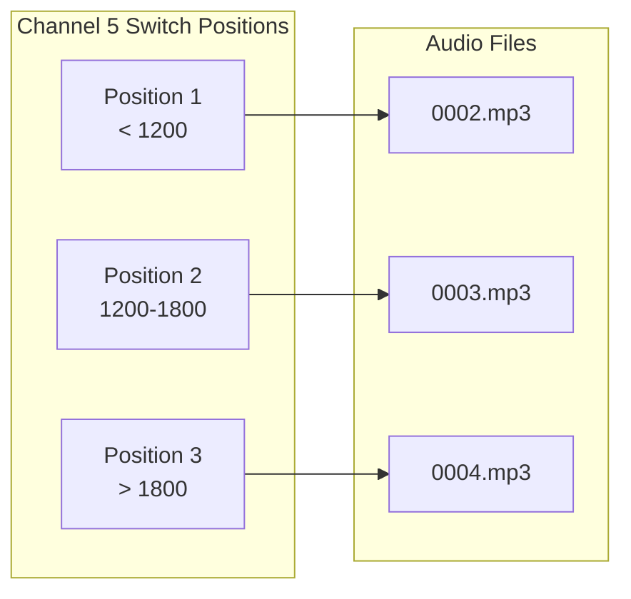
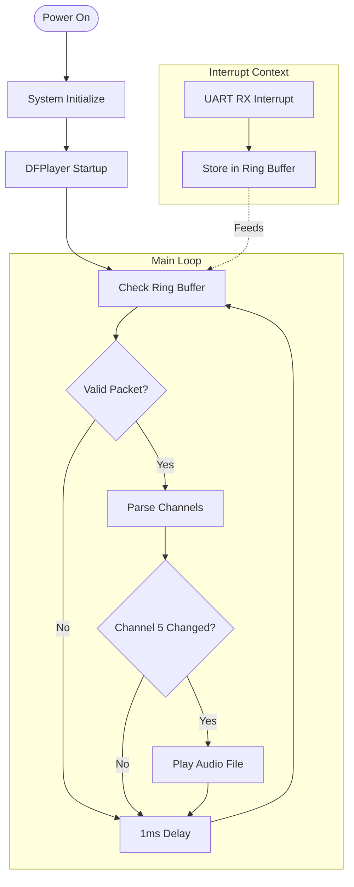

# PIC16F18313 i-Bus Audio Controller

A microcontroller application for receiving FlySky i-Bus RC signals and controlling audio playback via DFPlayer Mini module.

## Overview

This project implements an i-Bus receiver that triggers audio playback based on RC switch positions. The system continuously monitors i-Bus channel 5 for switch changes and plays corresponding audio tracks through a DFPlayer Mini module.

## Hardware Configuration

- **Microcontroller**: PIC16F18313 (8-pin PDIP package)
- **Clock**: 32MHz internal oscillator
- **UART**: 115200 baud for both i-Bus reception and DFPlayer communication
- **Audio Module**: DFPlayer Mini with SD card containing MP3 files

### Pin Assignment
```
PIC16F18313 Pinout:
┌─────────────┐
│1  VDD   VSS │8
│2  RA5   RA0 │7  ← i-Bus RX (RC1RX)
│3  RA4   RA1 │6  → DFPlayer TX (RC1TX)
│4  RA3   RA2 │5
└─────────────┘
```

## System Architecture



## Software Architecture

### Modular Design

The application follows a modular architecture with clear separation of concerns:



### Critical Design Decision: Ring Buffer Implementation

**Why Ring Buffer is Essential for i-Bus Reception:**

The i-Bus protocol sends continuous data packets at 115200 baud (approximately every 7ms). Missing even a single byte corrupts the entire packet and breaks synchronization.



**Alternative approaches that would fail:**

1. **Polling approach** (using MCC EUSART functions):
   - `EUSART_IsRxReady()` + `EUSART_Read()`
   - Would miss bytes during main loop processing
   - Cannot keep up with continuous 115200 baud stream

2. **Simple interrupt without buffering**:
   - Would lose data if main loop is busy
   - No protection against timing variations

**Ring buffer advantages:**
- **Interrupt-driven**: Captures every byte immediately
- **Buffered**: Tolerates main loop timing variations  
- **Reliable**: Prevents data loss in continuous streams
- **Efficient**: Minimal interrupt overhead

## Module Details

### ibus.c - i-Bus Protocol Handler

**Key Features:**
- Custom interrupt service routine for RX
- 64-byte ring buffer for continuous data capture
- Packet synchronization using header detection (0x20 0x40)
- Packet validation to reject corrupted data
- Channel value extraction (14 channels, 16-bit each)

**Packet Structure:**
```
i-Bus Packet (32 bytes):
┌────┬────┬────────────────────────────┬──────┐
│0x20│0x40│28 bytes channel data       │Chksum│
├────┼────┼────────────────────────────┼──────┤
│ 0  │ 1  │ 2-29 (14 channels × 2 bytes)│30-31 │
└────┴────┴────────────────────────────┴──────┘

Channel Data Format (little-endian):
Ch1: bytes 2-3, Ch2: bytes 4-5, ... Ch14: bytes 28-29
Range: 1000-2000 (center at 1500)
```

### dfplayer.c - Audio Control

**Communication Protocol:**
- Uses MCC-generated EUSART functions for transmission
- AT command format for DFPlayer Mini
- Startup sequence with volume control
- File-based playback from SD card

**Audio Mapping:**


### config.h - System Constants

Centralized configuration for all modules:
- i-Bus packet and buffer sizes
- DFPlayer volume and timing settings
- Hardware-specific definitions

## Data Flow



## Build Configuration

### MPLAB X Project Structure
```
uart.X/
├── main.c                 # Main application entry point
├── src/                   # Modular source code
│   ├── config.h          # System constants
│   ├── ibus.h/c          # i-Bus protocol implementation
│   └── dfplayer.h/c      # Audio control implementation
├── mcc_generated_files/   # MCC-generated hardware drivers
│   ├── system/           # System initialization
│   └── uart/             # UART/EUSART drivers
├── nbproject/            # MPLAB X project configuration
└── old/                  # Backup files
```

### Key Design Principles

1. **Separation of Concerns**: Each module has a specific responsibility
2. **Hardware Abstraction**: MCC handles low-level hardware configuration
3. **Interrupt-Driven I/O**: Critical for real-time data reception
4. **Robust Error Handling**: Packet validation and sync recovery
5. **Maintainable Code**: Clear documentation and modular structure

## Timing Considerations

### Critical Timing Requirements

```mermaid
gantt
    title System Timing Analysis
    dateFormat X
    axisFormat %s
    
    section i-Bus Stream
    Packet Reception :active, 0, 7
    Packet Gap       :2, 5
    
    section Interrupt Processing  
    ISR Execution    :crit, 0, 1
    Buffer Storage   :crit, 1, 2
    
    section Main Loop
    Packet Processing :3, 6
    Audio Command     :6, 7
    Loop Delay        :7, 8
```



**Performance Requirements:**
- **ISR Response**: < 50μs (critical for 115200 baud)
- **Main Loop**: 1ms cycle time
- **Packet Processing**: < 1ms per packet
- **Buffer Capacity**: 64 bytes (handles ~4-5 packets)

## Testing and Validation

### Packet Validation Strategy
1. **Header Sync**: Look for 0x20 0x40 sequence
2. **Length Check**: Ensure 32-byte packets
3. **Embedded Header Detection**: Reject packets with internal sync patterns
4. **Channel Range Validation**: Verify 1000-2000 range for channels

### Debug Capabilities
- Ring buffer occupancy monitoring
- Packet reception statistics
- Channel value debugging via UART

## Troubleshooting

### Common Issues

| Issue | Symptoms | Solution |
|-------|----------|----------|
| No Audio | Switch changes ignored | Check i-Bus wiring and baud rate |
| Intermittent Audio | Occasional missed switches | Verify ring buffer not overflowing |
| Audio Lag | Delayed response | Reduce main loop delay time |
| Corrupted Audio | Wrong tracks playing | Check SD card file names |

### Debug Points
1. Monitor `ring_buffer_available()` for buffer health
2. Check `get_channel_value(5)` for switch detection
3. Verify DFPlayer AT command responses
4. Test interrupt service routine timing

---

## License

This project is licensed under the MIT License - see the [LICENSE](LICENSE) file for details.

### Third-Party Components

- **MCC-Generated Code**: This project includes code generated by Microchip Code Configurator (MCC) from Microchip Technology Inc. See individual MCC-generated file headers for specific license terms.
- **Hardware Documentation**: Pin assignments and electrical specifications are based on PIC16F18313 datasheet from Microchip Technology Inc.
