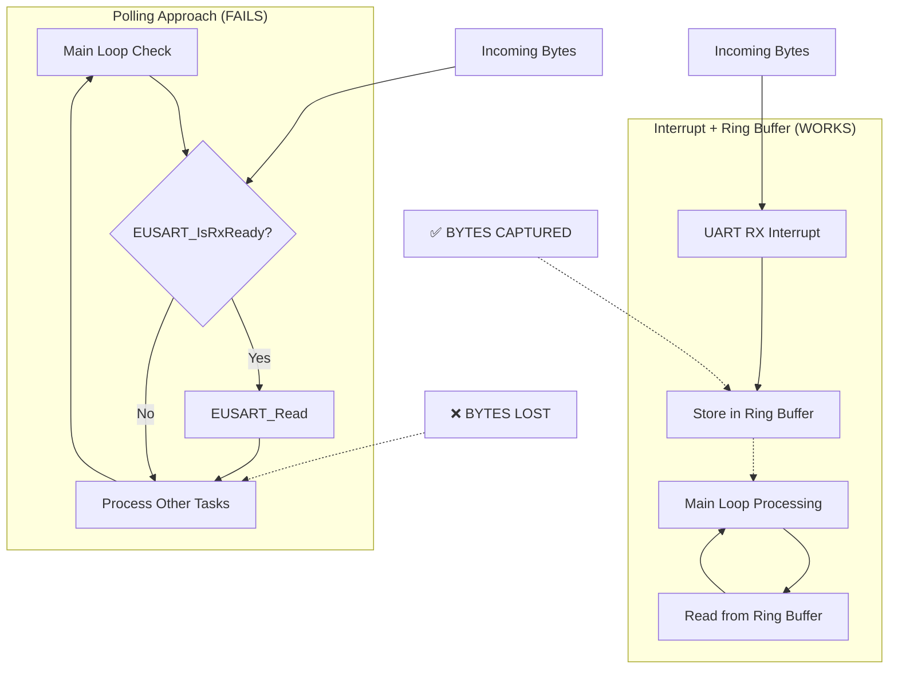
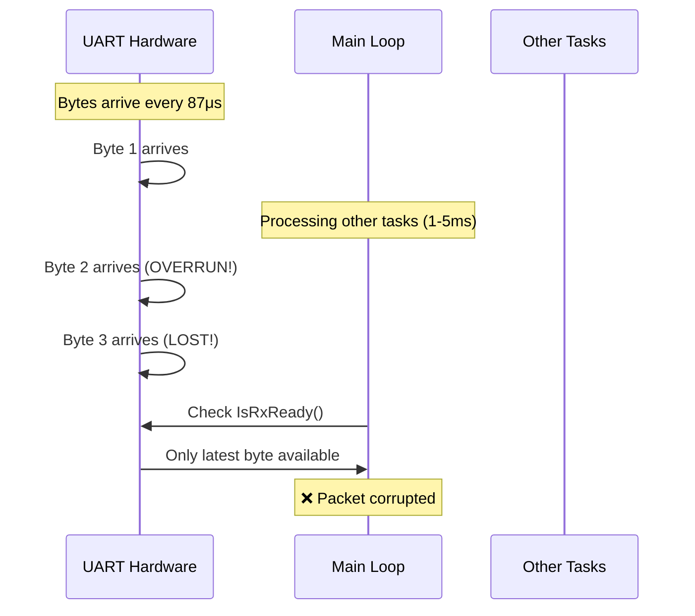
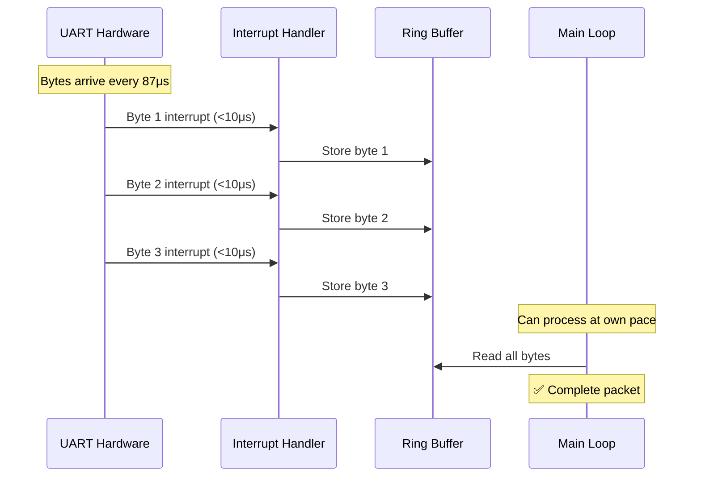
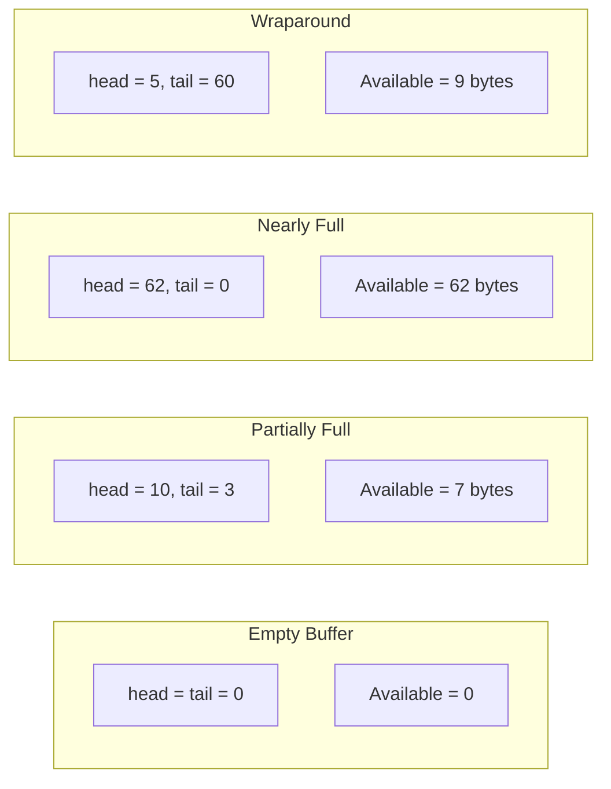
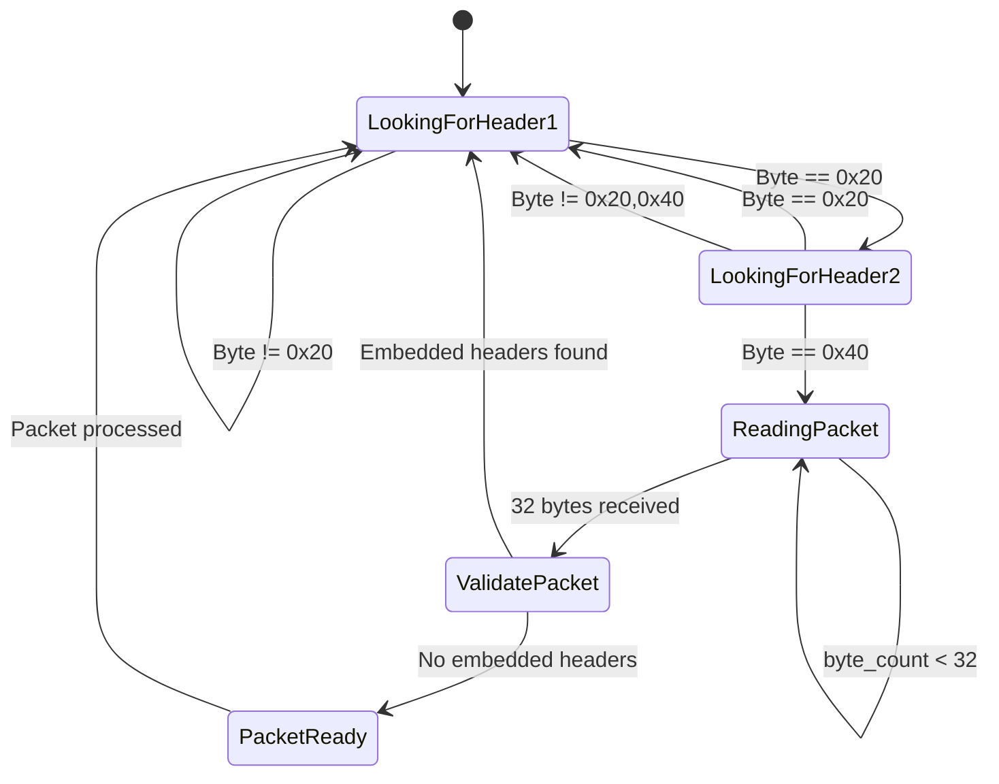
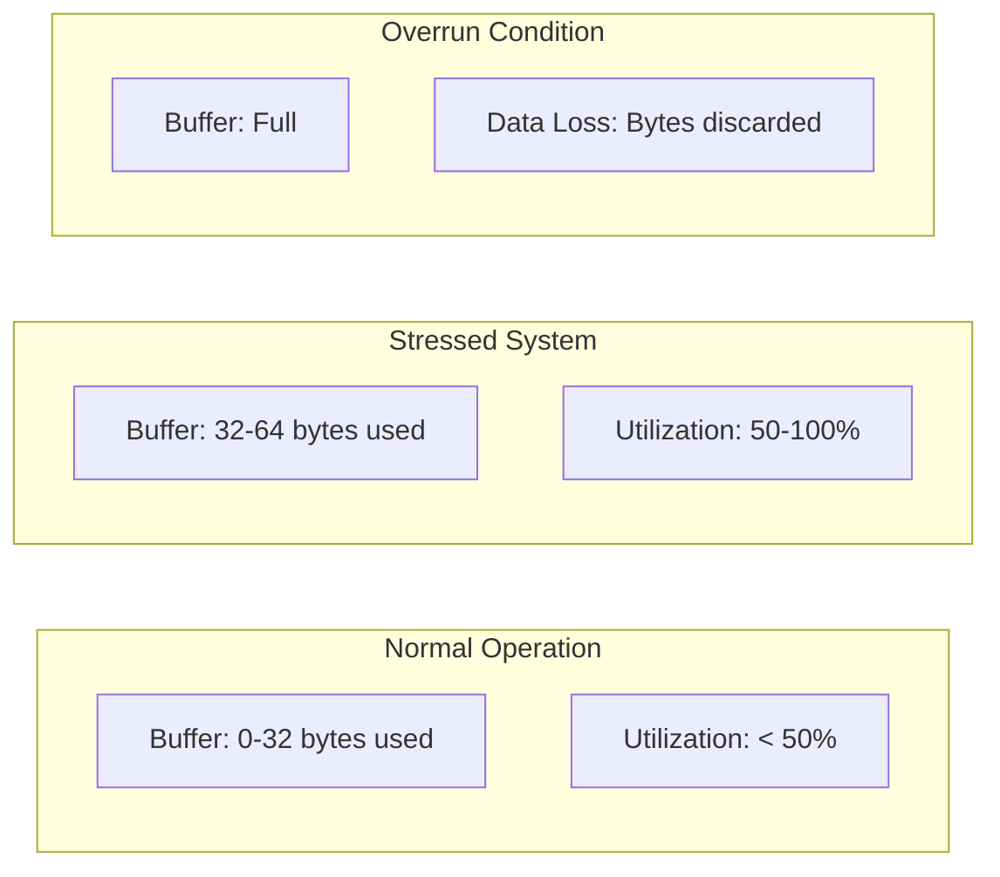
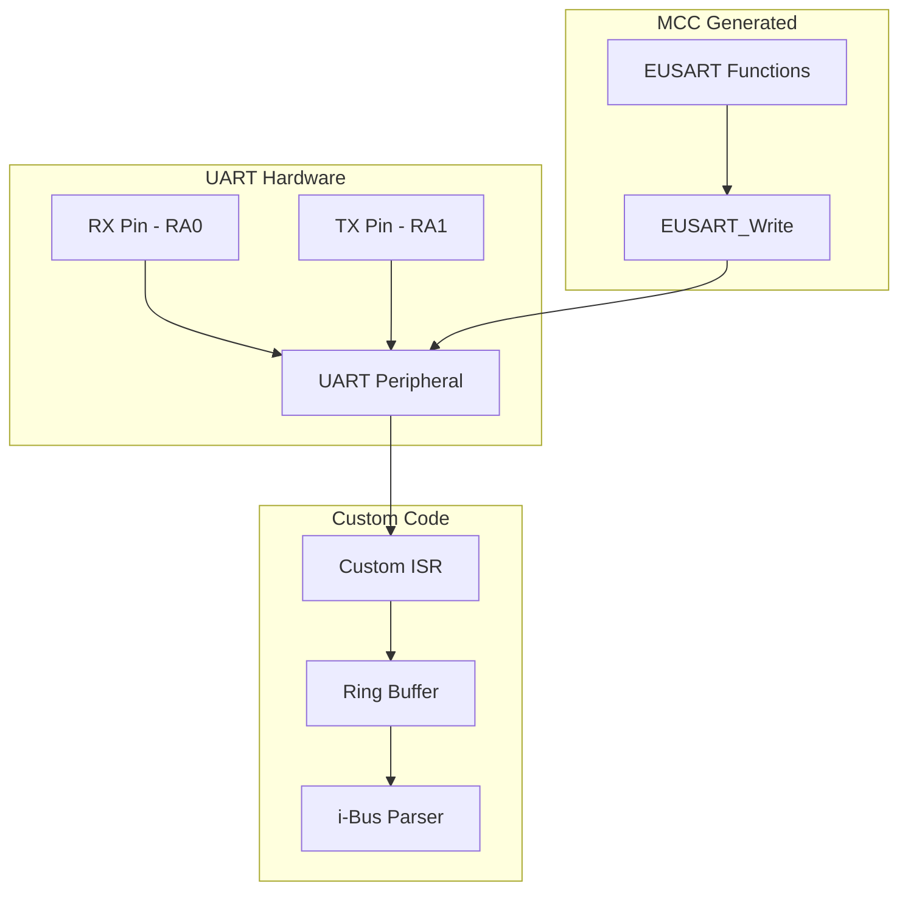
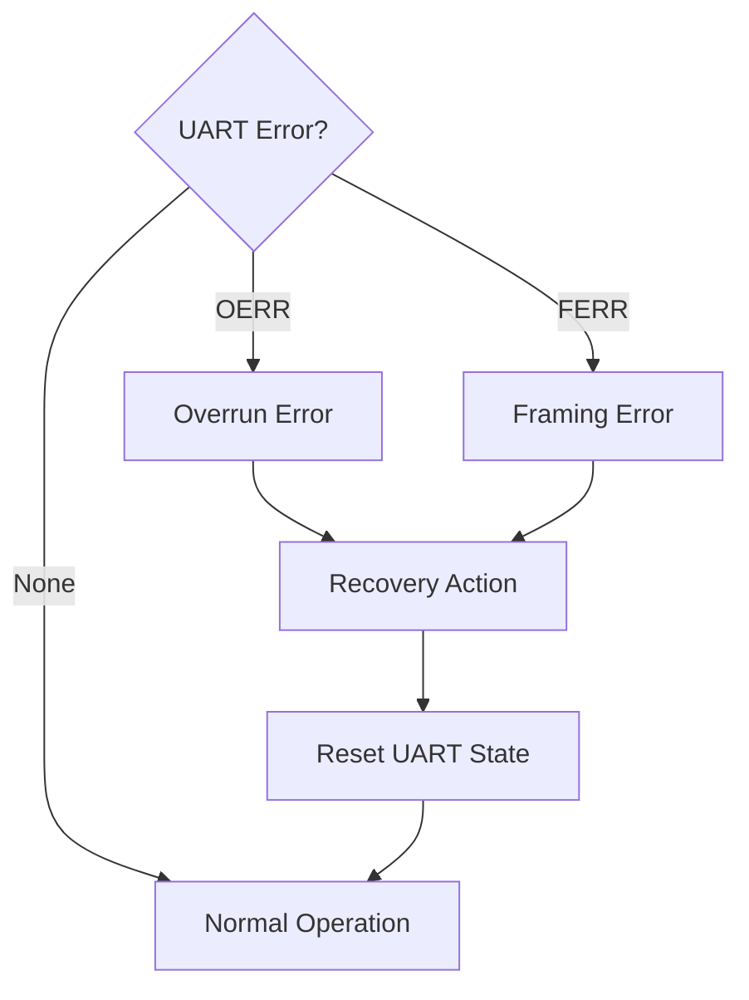

# Technical Architecture Documentation

## Ring Buffer Implementation Analysis

### Why Interrupt + Ring Buffer is Essential

The choice of interrupt-driven ring buffer over polling-based UART reading is critical for i-Bus protocol success. This document explains the technical reasoning.



### Timing Analysis: Why Polling Fails

**i-Bus Characteristics:**
- Baud Rate: 115200 bps
- Byte Time: ~87 μs per byte
- Packet Size: 32 bytes
- Packet Time: ~2.8 ms
- Packet Interval: ~7 ms

**Polling Approach Problems:**


**Ring Buffer Approach Success:**


## Memory Layout and Buffer Management

### Ring Buffer Implementation

```c
// Ring buffer structure
static volatile uint8_t ring_buffer[64];
static volatile uint8_t buffer_head = 0;  // Write pointer (ISR)
static volatile uint8_t buffer_tail = 0;  // Read pointer (Main)
```

**Buffer States:**


### Memory Safety Considerations

**Volatile Variables:**
```c
static volatile uint8_t buffer_head = 0;  // Modified by ISR
static volatile uint8_t buffer_tail = 0;  // Modified by main loop
```

**Race Condition Prevention:**
- Only ISR modifies `buffer_head`
- Only main loop modifies `buffer_tail`  
- No shared modification points = no race conditions
- Buffer full check prevents overflow

## Protocol State Machine

### i-Bus Packet Detection



### Packet Validation Logic

**Header Detection:**
```c
// State machine for robust sync
if (looking_for_header) {
    if (packet_pos == 0 && byte_val == 0x20) {
        // Found first header byte
        packet_pos = 1;
    } else if (packet_pos == 1 && byte_val == 0x40) {
        // Found second header byte - start packet
        packet_pos = 2;
        looking_for_header = 0;
    } else {
        // Reset on any mismatch
        packet_pos = 0;
    }
}
```

**Embedded Header Check:**
```c
// Validate no embedded sync patterns in data
for (i = 2; i < PACKET_SIZE - 1; i++) {
    if (packet[i] == 0x20 && packet[i+1] == 0x40) {
        valid = 0;  // Reject corrupted packet
        break;
    }
}
```

## Performance Characteristics

### Interrupt Service Routine Analysis

**ISR Requirements:**
- **Maximum execution time**: < 50μs
- **Actual execution time**: ~5-10μs  
- **Operations per interrupt**:
  1. Read UART register (1-2μs)
  2. Calculate buffer index (1μs)
  3. Store byte (1μs)
  4. Update pointer (1μs)
  5. Clear interrupt flag (1μs)

**ISR Code Efficiency:**
```c
void __interrupt() ISR(void) {
    if (PIE1bits.RCIE && PIR1bits.RCIF) {
        uint8_t received_byte = RCREG1;           // ~2μs
        uint8_t next_head = (buffer_head + 1) % 64; // ~1μs  
        if (next_head != buffer_tail) {           // ~1μs
            ring_buffer[buffer_head] = received_byte; // ~1μs
            buffer_head = next_head;              // ~1μs
        }
        PIR1bits.RCIF = 0;                      // ~1μs
    }
}
```

### Buffer Sizing Analysis

**Buffer Requirements:**
- **Minimum size**: 32 bytes (1 packet)
- **Recommended size**: 64 bytes (2 packets)
- **Safety margin**: 100% overhead
- **Worst case**: Main loop delayed 7ms = 1 extra packet

**Buffer Utilization:**


## Integration with MCC Generated Code

### Coexistence Strategy

**Dual UART Usage:**
- **RX (Receive)**: Custom interrupt handler for i-Bus
- **TX (Transmit)**: MCC EUSART functions for DFPlayer



**Function Usage:**
- **Custom**: `ISR()`, `ring_buffer_*()`, `read_ibus_packet()`
- **MCC**: `EUSART_Write()`, `EUSART_Initialize()`, `EUSART_IsTxReady()`

### Interrupt Priority Management

**Single Interrupt Level:**
- PIC16F18313 has only one interrupt priority
- All interrupts share same ISR
- UART RX has highest priority within ISR

```c
void __interrupt() ISR(void) {
    // UART RX - Highest priority (time critical)
    if (PIE1bits.RCIE && PIR1bits.RCIF) {
        // Handle immediately
        // ... ring buffer code ...
    }
    
    // Other interrupts can be added here
    // Timer, GPIO, etc.
}
```

## Error Handling and Recovery

### Error Detection Strategies

**Hardware Error Recovery:**


**Software Error Recovery:**
```c
// MCC provides error handling in EUSART_Read()
if (RC1STAbits.OERR) {
    // Overrun - reset receive logic
    RC1STAbits.CREN = 0;
    RC1STAbits.CREN = 1;  
}

if (RC1STAbits.FERR) {
    // Framing error - data corruption
    // Continue processing (transient error)
}
```

### Diagnostic Capabilities

**Buffer Health Monitoring:**
```c
uint8_t get_buffer_usage(void) {
    uint8_t head = buffer_head;
    uint8_t tail = buffer_tail;
    
    if (head >= tail) {
        return head - tail;
    } else {
        return (64 - tail) + head;
    }
}
```

**Performance Metrics:**
- Packets received per second
- Packet validation success rate  
- Buffer maximum usage
- ISR execution frequency

---

*This documentation captures the critical design decisions and technical rationale for the ring buffer implementation, ensuring future developers understand why this approach was chosen over simpler alternatives.*
